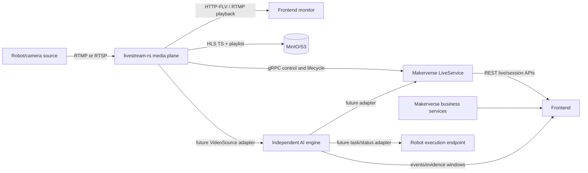

# Existing System Architecture Baseline

## Evidence boundary

This document describes the checked source snapshots at:

- `workspace/source-snapshots/Makerverse/` — `88423bc5e3b64dac1670180999b08e4cae36e5df`
- `workspace/source-snapshots/livestream-rs/` — `8b463533c5d218701482389dcdcf53eb18f5388f`

No runtime claim is made because the current Windows environment has no .NET SDK, Cargo or FFmpeg on PATH.

## System relationship



## Makerverse business plane

Makerverse is orchestrated by `Makerverse.AppHost/AppHost.cs` with .NET Aspire. The AppHost wires PostgreSQL databases, Keycloak, RabbitMQ, Redis, MinIO, Typesense, a YARP gateway and the Rust livestream service.

| Component | Responsibility | Relevant integration |
|---|---|---|
| AccountService | Keycloak token flow, user/admin operations, avatar storage | OIDC/token API; MinIO |
| ActivityService | activities, tags, comments, votes | REST; RabbitMQ events; Redis |
| LiveService | live CRUD, start/stop, status, endpoints, HLS segment serving | REST; gRPC client to livestream-rs; PostgreSQL/Redis/MinIO |
| SearchService | Typesense indexing for activity/live events | RabbitMQ and Typesense |
| Gateway | YARP routes for activities, tags, lives and search | Frontend base URL |

The live API controller is `LiveService/Controllers/LivesController.cs`:

- `POST /lives` — authenticated live creation;
- `GET /lives` — live list;
- `GET /lives/online` — active lives;
- `GET /lives/{id}` — live detail;
- `PUT /lives/{id}/status` with `start` or `stop` — authenticated owner control;
- `GET /lives/{id}/endpoint` — playback endpoint and owner-only ingest endpoint;
- `PUT /lives/{id}` and `DELETE /lives/{id}` — authenticated owner operations.

The DTO currently exposes `IngestUrl` and playback `RtmpUrl`/optional `HttpFlvUrl`. Browser playback therefore needs a compatible player or a later HLS/WebRTC adapter; RTMP is not a native browser media element source.

## livestream-rs media plane

The Rust workspace is layered as:

```text
livestream-rs binary
├─ livestream-core       shared traits, types, bounded pads and config
├─ livestream-codec      encoded packets, FLV tags, RTP packets, TS segments
├─ livestream-media      FFmpeg decoder/encoder/scaler/RTP/HLS wrappers
├─ livestream-pipeline   processor/sink pipeline and HLS/FLV branches
├─ livestream-transport  RTMP, RTSP, HTTP-FLV, gRPC and session registry
└─ livestream-telemetry  metrics and tracing
```

Default standalone ports and routes from the checked README/config are:

- RTMP ingest/playback: `1935`, application `lives`;
- RTSP ingest: `8554`;
- HTTP-FLV playback: `8080`, `/lives/{live_id}.flv` when enabled;
- gRPC control plane: `50051`;
- health: `/alive`, `/health`, `/health/stream/{live_id}`;
- HLS: TS and `index.m3u8` uploaded to MinIO/S3 by the pipeline.

Makerverse AppHost maps the Rust HTTP-FLV service to host port `8081` and connects LiveService to its gRPC/service-discovery endpoint. Port values must be read from the active deployment, not hard-coded in the frontend.

## Existing media data flow

```text
RTMP/RTSP source
  -> session registry and protocol handler
  -> source packets
  -> OTel/sequence cache
  -> FLV mux -> FLV broadcast -> HTTP-FLV/RTMP playback
  -> HLS segmenter -> MinIO/S3 TS + playlist
```

RTSP MJPEG can pass through the server-side FFmpeg transcode path to H.264. HLS initialization may be deferred until codec headers are available. Bounded channels and demand-aware fan-out are part of the media pipeline.

## AI integration boundary

The new AI service is independent. It consumes sources through the implemented `SourceResolver`/`FramePipeline` abstraction:

1. local JSONL fixture or future local file provider for deterministic tests;
2. generic URL/HLS adapter when available;
3. RTSP adapter when the runtime can decode it;
4. a future livestream-rs/Makerverse resolver that maps `source_id` and evidence windows to the persisted HLS playlist/segments.

The AI service stores event metadata, facts, confidence, review state and evidence windows. It does not duplicate the video archive. The exact evidence URL/segment contract remains an integration task.

The current `/api/v1/evidence/resolve` endpoint returns an explicit fixture, provided-but-unverified, unsupported, or unavailable status. It does not synthesize HLS/MinIO URLs.

## Frontend boundary

The frontend should depend on repository/provider interfaces rather than hard-coding `if (mock)` in page components:

- Mock provider for complete offline demonstration;
- AI REST provider for plugin/jobs/events/objects/persons;
- Makerverse adapter for account/live/session data;
- media player adapter for HTTP-FLV/HLS when available;
- future robot adapter for status/task display.

## Security and claims boundary

- Makerverse APIs use Keycloak/OIDC authorization on protected routes.
- livestream-rs gRPC bearer authentication is optional and must be enabled/configured explicitly.
- No user token or secret belongs in `workspace/submission/`.
- “疑似服药”“证据不足”“待人工复核” are acceptable application terms; medical diagnosis and 100% certainty are not.
