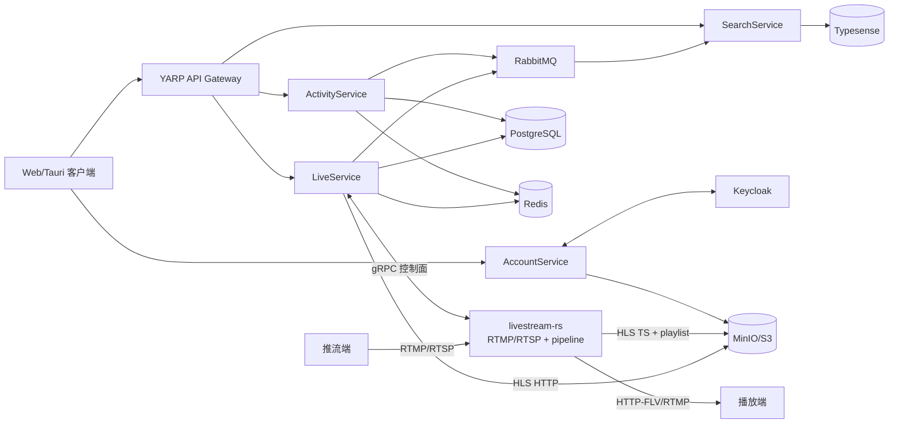
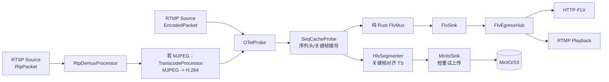

# Makerverse 与 livestream-rs 项目重要信息整理

> 资料基线：2026-09-22（Asia/Shanghai）
>
> 本文基于两个仓库当前拉取到本地的源码、配置、README、架构文档、测试和 CI 文件整理。源码快照：
>
> - [Makerverse](https://github.com/Stars-sea/Makerverse)，commit `88423bc5e3b64dac1670180999b08e4cae36e5df`（2026-08-05）
> - [livestream-rs](https://github.com/Stars-sea/livestream-rs)，commit `8b463533c5d218701482389dcdcf53eb18f5388f`（2026-08-05）
>
> 当前本地副本位于 `github-research/Makerverse` 和 `github-research/livestream-rs`。本文是源码级理解和运行准备资料，不把未执行的构建或真实推流称为运行通过。

## 1. 先建立整体认识

这两个项目组成一套直播社区后端，但边界非常清楚：

- `Makerverse` 是业务控制面，负责账号、活动/文章、直播记录、搜索、鉴权、API 网关和基础设施编排。
- `livestream-rs` 是媒体数据面，负责 RTMP/RTSP 接入、媒体管道、HTTP-FLV/RTMP 播放、HLS 分段和 MinIO/S3 上传。
- `Makerverse.LiveService` 通过 gRPC 调用 Rust 服务创建/停止/观察直播会话。
- Rust 服务将 HLS TS 和 `index.m3u8` 上传到 MinIO；LiveService 再按业务路由从 MinIO 读取 HLS。
- ActivityService 和 LiveService 通过 Wolverine + RabbitMQ 发布领域事件，SearchService 异步消费这些事件并写入 Typesense。
- 各业务服务各自拥有 PostgreSQL 数据库，不直接共享业务表。



### 1.1 重要的版本和仓库关系

| 项目 | 技术基线 | 许可/定位 | 仓库关系 |
|---|---|---|---|
| Makerverse | .NET 10、.NET Aspire 13.4.6、ASP.NET Core、EF Core、Wolverine 6.24.6 | 直播社区业务后端和部署编排 | 根仓库；`livestream-rs` 作为 Git submodule |
| livestream-rs | Rust 2024、workspace version 0.4.0、Tokio、FFmpeg 8 bindings、tonic、axum | 直播媒体服务器 | 独立仓库；Makerverse 的 `.gitmodules` 指向 `main`，但每个 Makerverse 提交实际固定一个 submodule commit |

Makerverse 的 `.gitmodules` 使用 SSH URL `git@github.com:Stars-sea/livestream-rs.git`。CI 在 checkout 前把它改写为 HTTPS；没有 SSH key 的环境应手动使用 HTTPS 或同样的 URL rewrite。

README 的一处描述需要以源码为准：Makerverse 服务表中出现过 “SRT/RTMP ingest”，但当前 `livestream-rs` 源码、协议枚举、端口配置和 gRPC API 都实现的是 RTMP 与 RTSP，没有 SRT server。当前可确认的接入协议是 RTMP、RTSP。

## 2. Makerverse：业务控制面

### 2.1 技术和基础设施

`Makerverse.AppHost/AppHost.cs` 用 Aspire 统一启动服务和基础设施，并通过 service discovery 注入连接串和环境变量。

| 资源 | 作用 | 关键配置/端口 |
|---|---|---|
| `account-svc` | 账号 API、Keycloak 代理、头像 | 容器 HTTP 8080；外部路径 `/account/` |
| `activity-svc` | 活动、标签、评论、浏览量 | PostgreSQL `activity-db`、Redis |
| `live-svc` | 直播业务记录、状态和 HLS 读取 | PostgreSQL `live-db`、Redis、MinIO、Rust gRPC |
| `search-svc` | Typesense 搜索 API和 RabbitMQ 消费者 | Typesense、RabbitMQ |
| `livestream-svc` | Rust 媒体服务 | gRPC 50050（AppHost 默认映射）、RTMP 1935、RTSP 8554、HTTP-FLV 8081 |
| `gateway` | YARP API 网关 | 宿主端口 8001；路由 `/activities`、`/tags`、`/lives`、`/search` |
| PostgreSQL | Keycloak、Activity、Live 数据库 | 本地默认宿主 5432 |
| Keycloak | OIDC/JWT、用户目录和角色 | 开发环境 HTTP 6001 |
| RabbitMQ | Wolverine 消息总线 | 5672；管理端口 15672 |
| Redis | 标签缓存及 Aspire 依赖 | service discovery |
| MinIO | 头像和直播 HLS 对象 | Aspire MinIO 资源 |
| Typesense | 活动和直播全文索引 | HTTP 8108，版本 30.1 |
| nginx-proxy | 生产环境按 `VIRTUAL_HOST` 路由 | 仅非 Development 环境加入 |

应用服务共同引用 `Makerverse.ServiceDefaults`，获得 OpenTelemetry、健康检查、service discovery 和 HTTP resilience。`Common` 提供 Keycloak JWT、Tauri CORS、Wolverine/RabbitMQ 和 ErrorOr 到 HTTP 状态码的通用扩展。

### 2.2 服务职责和源码入口

| 服务 | 入口 | 核心职责 | 数据/外部依赖 |
|---|---|---|---|
| AccountService | `AccountService/Program.cs` | OIDC password/refresh/logout/userinfo；用户注册和资料；头像上传、读取、删除 | Keycloak Admin/OIDC API、MinIO |
| ActivityService | `ActivityService/Program.cs` | 活动 CRUD、评论 CRUD、标签管理、标签校验、浏览量递增 | EF Core + PostgreSQL、Redis、RabbitMQ |
| LiveService | `LiveService/Program.cs` | 直播记录 CRUD、启动/停止会话、状态 watcher、端点生成、HLS 读取 | EF Core + PostgreSQL、Redis、MinIO、Rust gRPC、RabbitMQ |
| SearchService | `SearchService/Program.cs` | Typesense collection 初始化、活动/直播索引同步、搜索 API | Typesense、RabbitMQ |
| AppHost | `Makerverse.AppHost/AppHost.cs` | 服务、容器、参数、生产 Compose、依赖等待、域名和端口 | .NET Aspire、Docker/Podman |

### 2.3 AccountService API 和鉴权

路由在 `AccountService/Controllers`：

| 方法 | 路径 | 权限 | 作用 |
|---|---|---|---|
| POST | `/account/auth/token` | 匿名 | Keycloak Resource Owner Password 登录，返回原始 token JSON |
| POST | `/account/auth/refresh` | 匿名 | refresh token 换取新 token |
| POST | `/account/auth/logout` | 匿名 | 调 Keycloak logout |
| GET | `/account/auth/userinfo` | Bearer（手动读取头） | 转发 OIDC userinfo |
| POST | `/account/users/register` | 匿名 | 使用 client credentials 调 Keycloak Admin API 建用户并设置密码 |
| GET | `/account/users/me` | 登录用户 | 读取自己的 Keycloak profile |
| GET | `/account/users/{userId}` | 匿名 | 读取简化用户 profile |
| PUT | `/account/users/me` | 登录用户 | 更新 firstName/lastName |
| POST | `/account/users/me/avatar` | 登录用户 | multipart 上传头像；最大 5 MiB，允许 JPEG/PNG/WebP |
| GET | `/account/users/{userId}/avatar` | 匿名 | 从 MinIO 流式返回头像，带 ETag/缓存头 |
| DELETE | `/account/users/me/avatar` | 登录用户 | 删除头像对象 |

Keycloak 配置默认 realm 是 `makerverse`，公开 client 是 `makerverse`，AccountService Admin client 是 `makerverse-account-service`。JWT audience 固定校验 `makerverse`。没有 Keycloak service reference 时服务会降级为“不注册认证 scheme并记录 warning”，这适合开发探活，但不应被误认为已启用鉴权。

通用 CORS 只允许 `https://tauri.localhost`、`http://tauri.localhost` 和 `tauri://localhost`。HTTP-FLV 服务自己的播放响应另行允许 `Access-Control-Allow-Origin: *`。

### 2.4 ActivityService 数据模型和 API

模型位于 `ActivityService/Models`，EF 上下文是 `ActivityDbContext`：

- `Activity`：`Id`、`PublisherId`、`LinkedLiveId`、标题（最多 300）、正文（最多 2000）、创建/更新时间、`Votes`、`ViewCount`、标签 slug 列表、评论列表。
- `Comment`：活动 ID、发布者、正文（最多 500）、创建/更新时间、`Votes`。
- `Tag`：ID、名称、slug（最多 50）、描述（最多 1000）。

活动和评论的所有者检查使用 JWT 的 `ClaimTypes.NameIdentifier`。标签 slug 必须是 3–50 个小写字母、数字或 `-`；普通用户不能管理标签，标签创建/删除需要角色 `Admin`。

| 方法 | 路径 | 权限 | 作用 |
|---|---|---|---|
| POST | `/activities` | 登录用户 | 创建活动并发布 `ActivityCreated` |
| GET | `/activities` | 匿名 | 按更新时间/创建时间倒序返回简化活动 |
| GET | `/activities/publisher/{publisherId}` | 匿名 | 按发布者查询 |
| GET | `/activities/publisher/me` | 登录用户 | 查询自己的活动 |
| GET | `/activities/{id}` | 匿名 | 详情，并用 SQL `ViewCount + 1` 递增浏览量 |
| PUT | `/activities/{id}` | 活动所有者 | 修改并发布 `ActivityUpdated` |
| DELETE | `/activities/{id}` | 活动所有者 | 删除并发布 `ActivityDeleted` |
| POST | `/activities/{id}/comments` | 登录用户 | 添加评论 |
| GET | `/activities/{id}/comments` | 匿名 | 按创建时间倒序列出评论 |
| GET | `/activities/{id}/comments/{commentId}` | 匿名 | 读取单条评论 |
| PUT/DELETE | `/activities/{id}/comments/{commentId}` | 评论所有者 | 修改/删除评论 |
| GET | `/tags`、`/tags/{slug}` | 匿名 | 读取标签 |
| POST/DELETE | `/tags`、`/tags/{slug}` | `Admin` | 创建/删除标签 |

`TagService` 把所有 tag slug 缓存在 Redis set `Tags` 中，默认过期 10 分钟；创建/删除标签后主动失效。当前模型里 `Votes` 没有对应 API，图片字段也仍是 TODO。

### 2.5 LiveService 业务状态和 API

`LiveService/Models/Live.cs` 的业务状态为：

```text
Created -> Starting -> Started -> Stopped
                           \-> Invalid（异常/人工标记场景预留）
```

Rust gRPC 状态由 `LivestreamLifecycleWatcher` 映射：`Pending -> Created`、`Connecting -> Starting`、`Connected -> Started`、`Disconnected -> Stopped`。业务状态和 Rust session 状态分开存储，业务库是最终的展示状态，Rust registry 是媒体会话的实时状态。

| 方法 | 路径 | 权限 | 作用 |
|---|---|---|---|
| POST | `/lives` | 登录用户 | 建立 `Created` 直播记录并发布 `LiveCreated` |
| GET | `/lives` | 匿名 | 全部直播，按开始时间/创建时间倒序 |
| GET | `/lives/streamer/{streamerId}` | 匿名 | 按主播查询 |
| GET | `/lives/streamer/me` | 登录用户 | 查询自己的直播 |
| GET | `/lives/online` | 匿名 | 调 Rust `ListLivestreams`，再与业务库 join |
| GET | `/lives/{id}` | 匿名 | 读取业务记录 |
| PUT | `/lives/{id}` | 主播本人 | 修改标题并发布 `LiveUpdated` |
| DELETE | `/lives/{id}` | 主播本人 | 只有 `Stopped` 或 `Invalid` 才能删除，并发布 `LiveDeleted` |
| PUT | `/lives/{id}/status` | 主播本人 | `{"status":"start","protocol":"rtmp|rtsp"}` 启动，或 `{"status":"stop"}` 停止 |
| GET | `/lives/{id}/endpoint` | 匿名 | `Starting/Started` 时返回播放端点；只有主播返回推流端点 |
| GET | `/lives/{id}/segments` | 匿名 | 列出 MinIO 中的 TS 分段 |
| GET | `/lives/{id}/segments/index.m3u8` | 匿名 | 返回 HLS playlist |
| GET | `/lives/{id}/segments/{index}` 或 `/segment_{index}.ts` | 匿名 | 返回指定 TS 分段 |

`UpdateLiveStatusDto` 只验证 status 是 `start` 或 `stop`。protocol 只把大小写不敏感的 `rtsp` 映射为 RTSP，其他非空/缺省值都会走 RTMP；调用方应明确传 `rtmp` 或 `rtsp`，不要依赖拼写错误后的默认行为。

LiveService 生成的 URI：

| 用途 | RTMP | RTSP | HTTP-FLV |
|---|---|---|---|
| 推流 | `rtmp://{host}:{port}/lives/{live_id}` | `rtsp://{host}:{port}/live/{live_id}` | — |
| 播放 | `rtmp://{host}:{port}/lives/{live_id}` | — | `http://{host}:{port}/lives/{live_id}.flv` |
| HLS | — | — | `http(s)://{api-host}/lives/{live_id}/segments/index.m3u8` |

HLS 对象命名由 Rust 的 `SEGMENT__MINIO_PREFIX`（默认 `hls`）决定：`hls/{live_id}/segment_0000.ts` 和 `hls/{live_id}/index.m3u8`。LiveService 的 `LivestreamOptions` 默认前缀也是 `hls`，两侧必须保持一致。

### 2.6 消息合同和搜索一致性

`Contracts` 是零外部依赖的共享 DTO：

| Exchange | 消息 | 生产者 | 消费者/动作 |
|---|---|---|---|
| `activities` | `ActivityCreated` | ActivityService | SearchService 创建活动文档 |
| `activities` | `ActivityUpdated` | ActivityService | 更新 title/content/tags |
| `activities` | `ActivityDeleted` | ActivityService | 删除文档 |
| `lives` | `LiveCreated` | LiveService | 创建直播文档 |
| `lives` | `LiveUpdated` | LiveService | 更新 title |
| `lives` | `LiveDeleted` | LiveService | 删除文档 |
| `lives` | `LiveConnected`、`LiveTerminate` | LiveService watcher | 处理状态转移/异常连接；不是 Search 索引消息 |

SearchService 启动时只保证 `activities` 和 `lives` collection 存在，不做已有业务库的全量回填。搜索 API 为：

- `GET /search/activities?query=关键词`：搜索 `title,content`；可在 query 中写 `[tag-slug]` 触发标签过滤。
- `GET /search/lives?query=关键词`：搜索 `title`。

RabbitMQ 消费是异步的，数据库写入成功和搜索可见之间存在延迟；当前没有事务 outbox，所以消息发布失败可能造成业务库与 Typesense 短暂或长期不一致。

### 2.7 部署、参数和测试

开发启动：

```bash
aspire run
dotnet user-secrets --project Makerverse.AppHost set "account-service-client-secret" "<keycloak-client-secret>"
dotnet user-secrets --project Makerverse.AppHost set "typesense-api-key" "<typesense-key>"
```

生产部署的 README 流程是 `aspire deploy` 后到 `Makerverse.AppHost/aspire-output` 手动 `docker compose up -d`。Compose project name 要保持稳定；换 project name 会启动另一套带新 Keycloak 数据的栈。

Makerverse 测试分三层：

- Tier 1：校验器和错误映射的纯单元测试。
- Tier 3 Aspire E2E：真实启动 Keycloak、PostgreSQL、Redis、RabbitMQ、MinIO、Typesense、YARP、业务服务和 Rust 容器，覆盖认证、活动、直播、搜索。
- Stress：通过 gRPC 创建会话，ffmpeg RTMP 推流和拉流，验证多路帧收到；压力测试需要 `cargo`、`ffmpeg`、Docker/Podman。

AppHost 测试的一个关键事实是：`/account/*` 没有 YARP 路由，测试和客户端需要直连 `account-svc`；其他主要业务接口走 `gateway`。

## 3. livestream-rs：媒体数据面

### 3.1 Crate 分层

依赖方向是 `binary -> transport -> pipeline -> media/codec/core`。pipeline 不反向依赖 transport，通过 `FlvBroadcast` 和 `ObjectUploader` trait 注入播放广播及对象存储。

| crate | 职责 |
|---|---|
| `livestream-core` | 配置、`MediaPacket`、`Source/Processor/Sink/Pipeline` trait、有界 Pad 通道、demand signal、pipeline state |
| `livestream-codec` | `EncodedPacket`、`RtpPacket`、`TsSegment`、`NalData`、codec/segment 类型 |
| `livestream-media` | 唯一允许直接使用 FFmpeg unsafe 的层；AVPacket/AVFrame/codec context/scaler/RTP demux/HLS mux/FLV 编解码 |
| `livestream-pipeline` | OTel probe、序列头缓存、FLV mux、HLS segmenter、RTSP RTP depacketizer、MJPEG 转码、MinIO sink |
| `livestream-transport` | RTMP、RTSP、HTTP-FLV、gRPC、session registry、事件分发、连接上限和协议生命周期 |
| `livestream-telemetry` | tracing、OpenTelemetry metrics/traces/logs（feature 默认打开） |
| `livestream-test-utils` | gRPC 控制、ffmpeg 推拉、MinIO 相关的 E2E/压力测试工具 |

workspace package version 是 `0.4.0`、Rust edition 2024、license `GPL-3.0`。主要依赖包括 Tokio、`rml_rtmp`、`rtsp-types`、tonic 0.14、axum 0.8、FFmpeg `ffmpeg-sys-next` 8、MinIO client。

### 3.2 进程启动和降级策略

`src/main.rs` 的顺序是：

1. 初始化 FFmpeg 网络和日志桥接。
2. 读取可选 `config.toml`，再读取环境变量（环境变量覆盖文件）。
3. 创建 MinIO client；缺配置或连接失败时使用 `NullUploader`，HLS 分段会丢弃并 warning，FLV 仍可运行。
4. 创建共享 `FlvEgressHub`、`SessionRegistry`、`EventDispatcher`。
5. 尝试启动 RTMP、RTSP server；任一监听失败只禁用该输入协议并记录 warning。
6. 创建 gRPC server；gRPC 是控制面，创建失败会让进程失败退出。
7. 创建 HTTP-FLV server；它始终绑定健康端点，`HTTP_FLV__ENABLED` 只控制播放路由。
8. 收到 SIGINT/SIGTERM 后取消所有服务，等待最多 10 秒排空。

### 3.3 协议和端点

| 协议 | 默认端口 | 作用 | 备注 |
|---|---:|---|---|
| RTMP | 1935 | 推流和 RTMP 播放 | 使用 `rml_rtmp`；推流必须先通过 gRPC 预创建 session |
| RTSP | 8554 | RTSP ANNOUNCE/SETUP/RECORD/TEARDOWN 接入 | RTP 通过 TCP interleaving；推流前必须预创建 |
| HTTP-FLV | 8080 | `/lives/{live_id}.flv` 播放、`/alive`、`/health`、`/health/stream/{live_id}` | 监听始终存在，播放路由可关闭 |
| gRPC | 50051 | 控制面和生命周期观察 | reflection 开启；可选 Bearer token |

RTMP 播放只允许状态为 `Connected` 的 stream。HTTP-FLV 新订阅者先收到缓存的 metadata、视频序列头和音频序列头，然后进入实时广播；广播 lag 后会跳过旧 tag，等下一个关键帧恢复。

### 3.4 gRPC 控制面

协议定义在 `proto/livestream.proto`，C# 客户端由 LiveService 的同一 proto 生成：

| RPC | 作用 | 典型返回/错误 |
|---|---|---|
| `StartLivestream` | 按 live_id 和 RTMP/RTSP 预创建待推流 session | 重复 live_id 为 already exists；返回完整 `StreamDescriptor` |
| `StopLivestream` | 取消 session 并等待 registry 清理 | 不存在为 not found；返回 `is_success` |
| `ListLivestreams` | 列出 registry 当前 session | 包含 Pending/Connecting/Connected，直到清理 |
| `GetLivestreamInfo` | 查一个 session descriptor | 不存在为 not found |
| `WatchLivestream` | 流式观察 Pending/Connecting/Connected/Disconnected | 以状态变化事件输出，Disconnected 后结束 |
| `GetServiceInfo` | 返回 gRPC/RTMP/RTSP/HTTP-FLV 端口 | 禁用的协议端口为 0 |

`GRPC__AUTH_TOKEN` 未设置时 gRPC 公开；设置后包括 reflection 在内的所有请求都必须带 `authorization: Bearer <token>`。live_id 只做“非空”校验，协议层不会限制字符集；写入文件或 MinIO key 时 pipeline 另用 `sanitize_stream_id` 保留 `[A-Za-z0-9_-]` 并截断到 128 字符。

### 3.5 session 状态机和控制流程

Rust registry 状态是：

```text
Pending -> Connecting -> Connected -> Disconnected
      \----------------> Connected
```

`ProtocolServerCore` 共用 RTMP/RTSP 的 accept、控制消息、连接数 semaphore、预创建 TTL 和 JoinSet 任务跟踪：

1. gRPC `StartLivestream` 向对应协议控制队列发送 `PrecreateStream`。
2. 控制循环检查 live_id 是否已存在，创建 `FlvEgressHub` channel 和 `Pending` descriptor。
3. 默认 30 秒内没有真实推流就 TTL 过期，取消生命周期、删除 registry 和 FLV channel。
4. RTMP publish 或 RTSP RECORD 必须匹配 pending lifecycle，否则被拒绝。
5. 第一个有效媒体输入推进到 `Connected`；`EventDispatcher` 广播 SessionStarted。
6. 客户端断开、TEARDOWN、管理员 Stop、错误或 TTL 都会取消 token；registry 标记 Disconnected，短暂 grace period 后移除。

`HandlerLifecycle` 使用原子标志保证 connect/disconnect 幂等，并在 Drop 时兜底断开。播放端连接不会取消发布端共享的 stream token。

### 3.6 统一媒体管道

标准的 `EncodedPacket` 管道如下：



- RTMP source 将 FLV AVC 的 AVCC NAL 转成 Annex B；sequence header 单独携带 AVCDecoderConfigurationRecord。
- RTSP source 接收 RTP interleaved frame；`RtpDemuxProcessor` 把 RTP packet 送入 FFmpeg demuxer，再生成 `EncodedPacket`。
- RTSP MJPEG 不能直接进入 FLV/HLS，所以 `TranscodeProcessor` 在每条流独占的 Mutex 中串行使用 Decoder、Encoder、Scaler 和 Frame，将 MJPEG 编码为 H.264。未配置输出 FPS 时会测量源帧间隔，编码器显式设置 frame rate，避免 time base 被错误当成 1000 fps。
- `FlvMux` 是纯 Rust，不再使用 FFmpeg FLV 输出；它处理 H.264/H.265/AAC，其他 codec 会丢弃并计数。
- RTMP codec 参数在带内 sequence header 到达后才知道，因此 HLS 分支延迟创建；RTSP 通常在 SDP/FFmpeg stream metadata 已知时立即创建。
- `HlsSegmenter` 使用 FFmpeg MPEG-TS muxer，但 TS 数据先写入内存，再一次性落到临时文件，随后由 `MinIoSink` 异步上传分段和 playlist。
- `PipelineImpl` 取消后给各 task 最多 5 秒排空，超时 abort；进程级 server drain 预算是 10 秒。

### 3.7 通道、反压和观众行为

Pad 使用有界 MPSC/broadcast 通道：默认 `RTMP_FORWARD=8192`、`FLV_RELAY=2048`、`PACKET_RELAY=2048`、`CONTROL=1024`、`EVENT=4096`。MPSC 满时丢当前 item 以维持低延迟；广播 receiver lag 时跳过旧消息。

`DemandSignal` 让 processor 在没有下游 demand 时可以不拉取输入；HLS sink 使用 always-wanted，因为录制不依赖观众。HTTP-FLV/RTMP 播放使用每流 broadcast channel（容量 1024）和序列头缓存，慢消费者恢复时等待下一个关键帧。

### 3.8 HLS/MinIO 细节

关键环境变量：

| 环境变量 | 默认值 | 说明 |
|---|---:|---|
| `SEGMENT__DURATION_SECS` | 10 | 目标 TS 分段时长 |
| `SEGMENT__CACHE_DIR` | 系统临时目录 | 本地暂存目录 |
| `SEGMENT__PLAYLIST_SIZE` | 5 | playlist 保留条数，0 表示不限制 |
| `SEGMENT__MINIO_PREFIX` | `hls` | 对象 key 前缀 |
| `SEGMENT__MAX_STAGED_SEGMENTS` | 100 | 配置字段已存在，但当前 LRU 淘汰未实现 |
| `MINIO__URI` | 无 | MinIO/S3 endpoint |
| `MINIO__ACCESS_KEY` | 无 | access key |
| `MINIO__SECRET_KEY` | 无 | secret key |
| `MINIO__BUCKET` | 无 | bucket |

MinIO 上传失败会重试两次，等待 200ms、500ms；成功或最终失败后删除暂存 TS 文件。缺 MinIO 时 `NullUploader` 直接删除并丢弃分段，因此只能得到 FLV，不能得到可播放 HLS。

### 3.9 安全和资源保护

已有保护包括：

- RTMP、RTSP、HTTP-FLV 可分别配置最大并发连接数；0 表示无限制。
- RTMP client chunk size 被限制在安全范围内。
- RTSP header/body 最大 64 KiB，并有 30 秒 idle timeout，防止慢速连接无限占用。
- RTMP/RTSP 预创建 TTL 默认 30 秒，避免大量悬空 session。
- stream_id 在文件路径和对象 key 使用前会消毒并限制长度。
- FFmpeg raw pointer 的拥有和释放集中在 `livestream-media`，其他 crate 只传类型化对象。

默认安全边界仍然有限：RTMP/RTSP ingest 本身没有用户级认证，gRPC token 是可选的，HTTP-FLV 使用通配 CORS。若服务端口暴露到不可信网络，需要在入口网关、网络 ACL 或部署层增加认证与访问限制。

## 4. 两个项目的完整联动时序

一次 RTMP 直播的实际链路：

1. 客户端登录 Keycloak，拿到 Bearer token。
2. `POST /lives` 在 LiveService 建立 `Created` 业务记录。
3. `PUT /lives/{id}/status` 传 `{"status":"start","protocol":"rtmp"}`。
4. LiveService 调 Rust `StartLivestream(live_id, RTMP)`；Rust 创建 Pending session，返回 `rtmp://.../lives/{id}` 和 HTTP-FLV 播放端点。
5. LiveService 把业务状态置为 `Starting`，并把该 live_id 放入 watcher queue。
6. 推流端连接 RTMP，Rust 校验 app name 和 pending live_id，收到媒体后推进 `Connecting -> Connected`。
7. Rust 通过 gRPC `WatchLivestream` 输出状态；LiveService watcher 将业务状态改为 `Started` 并发布 `LiveConnected`。
8. 媒体进入 FLV 广播和 HLS 分支；HLS 分支把 `hls/{id}/...` 上传 MinIO。
9. 观众可以使用 HTTP-FLV/RTMP，客户端也可以通过 LiveService 的 HLS API 读取 playlist/TS。
10. 停止时 LiveService 调 `StopLivestream`，Rust 取消 pipeline、广播 `Disconnected` 并清理 registry；LiveService 更新 `Stopped`，后续可 DELETE 业务记录。
11. 删除直播发布 `LiveDeleted`；LiveService 尝试删除 MinIO 分段。

RTSP 流程只替换第 3、4、6 步：协议为 RTSP，推流路径为 `/live/{id}`，经 SDP/RTP demux；MJPEG 会先转 H.264 再进入同一 FLV/HLS 管道。

## 5. 源码中已经暴露的缺口和风险

以下项目不是推测，而是当前源码、注释或架构文档已经明确显示的事项：

1. **SRT 文档漂移**：Makerverse 某处仍写 SRT ingest，但 Rust 当前无 SRT server。对外能力说明应以 RTMP/RTSP 为准。
2. **HLS 暂存上限未真正执行**：`SEGMENT__MAX_STAGED_SEGMENTS` 有配置和文档，但 LRU 淘汰逻辑尚未实现。MinIO 长时间不可用时仍需关注磁盘行为。
3. **HLS 对象清理实现需要修复/复核**：`LiveService/Services/LivestreamPersistentService.cs` 的 `DeleteSegmentsAsync` 从 `ListSegmentsAsync` 得到相对文件名，却直接把这些相对名交给 MinIO 删除；同时 `RemoveObjectsAsync` 被调用了两次，而且没有显式删除 `index.m3u8`。这段代码应在真实 MinIO 环境补测试后修正。
4. **分段读取没有缓存**：LiveService 自己标注 TODO，每次 playlist/TS 请求都访问 MinIO。
5. **搜索没有回填和 outbox**：SearchService 只建 collection，不扫描已有业务数据；业务事务和 RabbitMQ 发布也不是同一事务。
6. **控制面认证默认关闭**：`GRPC__AUTH_TOKEN` 不设置时 gRPC reflection 和控制 RPC 都公开；RTMP/RTSP 也没有用户级认证。
7. **live_id 只验证非空**：URL 生成、RTMP stream key、MinIO 消毒后的 key 可能出现语义不一致，业务层应定义稳定的 ID 字符集。
8. **协议参数容错偏宽**：LiveService 的 protocol 除 `rtsp` 外都按 RTMP 处理；调用方输入错误不会被拒绝。
9. **直播状态 watcher 的异常路径需要监控**：状态 watcher 是后台任务；启动 gRPC 失败、watch 失败或无效状态转移主要靠日志和事件处理，LivesController 还有 TODO 未补 telemetry。
10. **功能字段尚未闭环**：Activity 的 `Votes` 没有 API，图片 URL 字段仍为 TODO；它们目前只是模型字段。
11. **部署依赖严格**：Rust Dockerfile 使用 Ubuntu 26.04 和 FFmpeg 8 dev/runtime；宿主直接构建需要 clang、libclang、protobuf compiler、FFmpeg headers、Rust toolchain。版本不匹配会在 native linking 或 bindgen 阶段失败。

## 6. 构建、运行和验证清单

### 6.1 livestream-rs

Ubuntu/Debian 依赖：

```bash
sudo apt-get install -y build-essential clang libclang-dev pkg-config \
  libssl-dev libavcodec-dev libavformat-dev libavutil-dev libswscale-dev \
  protobuf-compiler
```

启动最小配置示例：

```bash
export RTMP__PORT=1935
export RTMP__APP_NAME=lives
export RTMP__SESSION_TTL_SECS=30
export RTSP__PORT=8554
export HTTP_FLV__ENABLED=true
export HTTP_FLV__PORT=8080
export GRPC__PORT=50051
export SEGMENT__DURATION_SECS=10
export SEGMENT__CACHE_DIR=/tmp/livestream-segments
export MINIO__URI=http://localhost:9000
export MINIO__ACCESS_KEY=minioadmin
export MINIO__SECRET_KEY=miniokey
export MINIO__BUCKET=videos
export RUST_LOG=info

cargo build --release
cargo run --release
```

验证命令：

```bash
cargo test --workspace
cargo fmt --all -- --check
cargo clippy --workspace --all-targets -- -D warnings
./scripts/e2e-test.sh
cargo run --release -p livestream-test-utils -- --help
```

`scripts/e2e-test.sh` 会验证 RTMP 推流到 HTTP-FLV 拉流，并验证 RTSP MJPEG 推流经服务端转码后能被 HTTP-FLV 解码。

### 6.2 Makerverse

前置条件：.NET SDK 10、Aspire CLI 13.4.6、Docker/Podman；Rust 子模块相关的压力测试还需要 cargo、ffmpeg 和 protoc。

```bash
aspire run
dotnet test
dotnet test --filter SmokeTests
dotnet test --filter "Category=Stress"
```

CI 先 checkout submodule、安装 ffmpeg/protoc/Rust，再优先拉取精确 submodule SHA 对应的 `livestream-svc` GHCR 镜像；拉不到才本地 Docker build。这是为了避开 Aspire 测试启动时重复执行 cargo-chef 冷构建。

### 6.3 本次整理的验证边界

本次环境探测未发现可调用的 `dotnet` SDK、`cargo` 或 `ffmpeg`，因此没有执行 `dotnet test`、`cargo test`、Docker 启动或真实推拉流。本文中的接口、默认值、状态转换和缺口均来自当前源码/配置/测试文件；若要把“源码理解”升级为“可运行确认”，应先补齐工具链，然后至少执行 Rust workspace tests、Rust E2E、Makerverse Smoke/E2E 和一条 RTMP/RTSP 实机链路。

## 7. 重要源码索引

| 主题 | 文件 |
|---|---|
| Aspire 编排 | `Makerverse.AppHost/AppHost.cs` |
| Rust 自定义 Aspire resource | `Makerverse.AppHost/ApplicationModel/LivestreamBuilderExtensions.cs`、`LivestreamResource.cs` |
| 认证和 RabbitMQ 通用配置 | `Common/AuthExtensions.cs`、`Common/WolverineExtensions.cs` |
| Live API/状态 watcher | `LiveService/Controllers/LivesController.cs`、`LiveService/Services/LivestreamLifecycleWatcher.cs` |
| Live gRPC client/端点 | `LiveService/Services/LivestreamService.cs`、`StreamDescriptorConverter.cs`、`Protos/livestream.proto` |
| HLS 读取和清理 | `LiveService/Controllers/SegmentController.cs`、`Services/LivestreamPersistentService.cs` |
| Search event handlers | `SearchService/MessageHandlers/`、`SearchService/Data/SearchInitializer.cs` |
| Rust 主进程 | `src/main.rs`、`src/config.rs` |
| Rust 协议控制 | `crates/livestream-transport/src/protocol_server.rs`、`grpc/server.rs`、`rtmp/`、`rtsp/` |
| Rust session/lifecycle | `registry/`、`lifecycle.rs`、`dispatcher/` |
| Rust pipeline wiring | `crates/livestream-pipeline/src/factory.rs`、`engine.rs`、`task.rs` |
| Rust MJPEG/RTP/HLS/FLV | `processor/transcode.rs`、`processor/rtp_depack/`、`processor/hls_segment.rs`、`processor/flv_mux.rs` |
| Rust FFmpeg ownership | `livestream-rs/docs/ffmpeg-unsafe-ownership-map.md` |
| Rust data flow | `docs/data-flow-architecture.md`、`docs/transport-pipeline-architecture.md` |
| 全栈测试 | `Makerverse.AppHost.Tests/README.md`、`Makerverse.AppHost.Tests/AppHostFixture.cs` |

## 8. 建议的后续使用方式

如果后续要继续开发，建议把这份文档当作导航索引，先固定三份契约再改代码：

1. 固定 `livestream.proto` 和 LiveService 的端点/状态映射。
2. 固定 MinIO bucket、prefix、对象命名及删除语义，并为 playlist、TS 上传和清理补集成测试。
3. 固定认证边界：谁能调用 gRPC、谁能推 RTMP/RTSP、谁能读取 HTTP-FLV/HLS。
4. 对 RabbitMQ 事件补重试、幂等和回填策略，避免搜索索引依赖一次性消息成功。
5. 在修改 FFmpeg 或 pipeline 前先阅读 `ffmpeg-unsafe-ownership-map.md`，保持 raw pointer 的所有权只留在 `livestream-media`。
